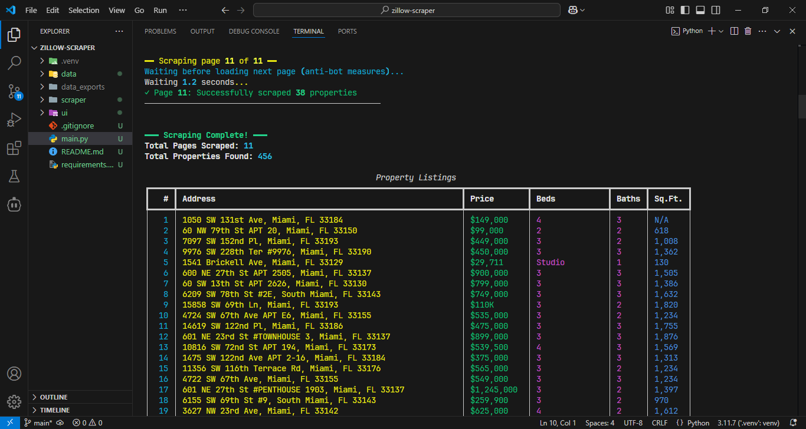
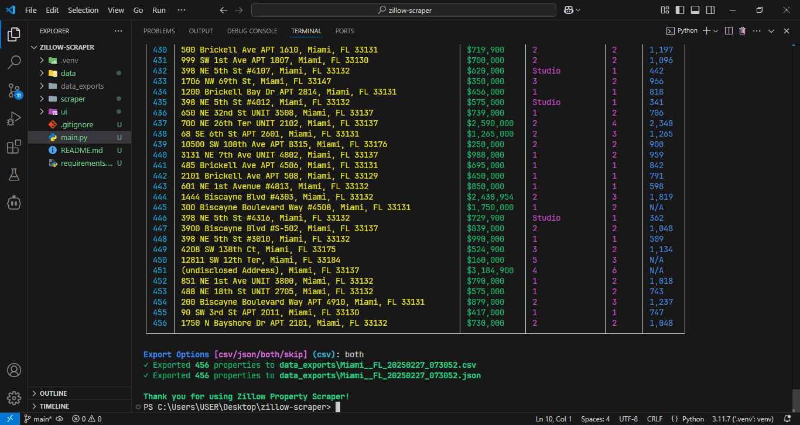

# Zillow Property Scraper

A powerful web scraper for Zillow real estate listings that effectively handles anti-bot measures and dynamic content loading. Built with Python, this tool successfully navigates Zillow's complex website structure while maintaining a low detection profile.

## Screenshots
### Scraped properties


### Scraped properties in CSV & JSON format


## Features

- 🛡️ Advanced anti-bot detection avoidance
- 🔄 Handles dynamic content and lazy loading
- 📊 Comprehensive property data extraction
- 💾 Multiple export formats (CSV & JSON)
- 🚀 Asynchronous operation for better performance
- 📱 Responsive to different page states and loading conditions
- 🔍 Smart pagination handling
- 📈 Real-time progress tracking

## Installation
```bash
Clone the repository
git clone https://github.com/ImranDevPython/zillow-property-scraper.git
Navigate to project directory
cd zillow-property-scraper
Install required packages
pip install -r requirements.txt
```

## Usage

Run the scraper using:
```bash
python main.py
```

The CLI will guide you through:
1. Entering location (city and state)
2. Selecting number of pages to scrape
3. Choosing export format (CSV/JSON)

## How It Works

The scraper implements several sophisticated techniques to handle Zillow's anti-bot measures:

- Dynamic wait times between requests
- Natural scrolling behavior simulation
- Automatic handling of lazy-loaded content
- Smart detection of page load completion
- Automatic retry mechanisms for failed requests
- Browser fingerprint randomization

## Data Output

The scraper collects comprehensive property information including:
- Full address
- Price
- Number of bedrooms
- Number of bathrooms
- Square footage

Data can be exported in both CSV and JSON formats, with automatic file naming based on location and timestamp.

## Anti-Detection Measures

- Random delays between actions
- Smooth scrolling simulation
- Dynamic user-agent management
- Intelligent request throttling
- Automatic session management
- Smart pagination handling

## Requirements

- Python 3.7+
- DrissionPage
- Rich (for CLI interface)
- AsyncIO

## Contributing

Contributions are welcome! Please feel free to submit a Pull Request.

## License

This project is licensed under the MIT License - see the LICENSE file for details.

## Author

[ImranDevPython](https://github.com/ImranDevPython)

## Disclaimer

This tool is for educational purposes only. Please review Zillow's terms of service before use. Be responsible and respectful with scraping frequency.
